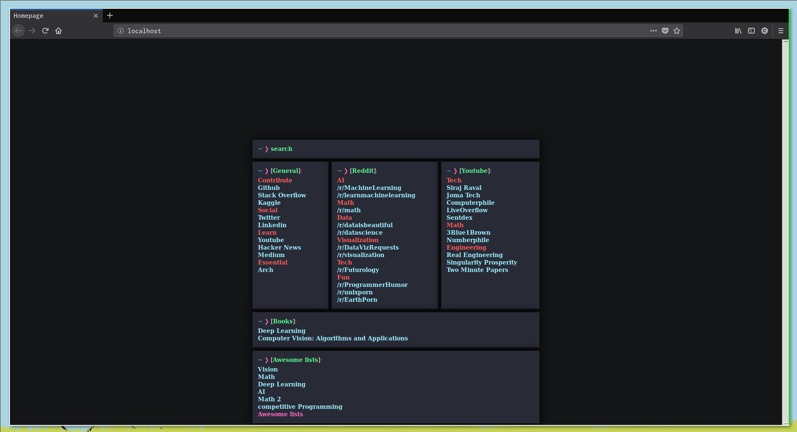
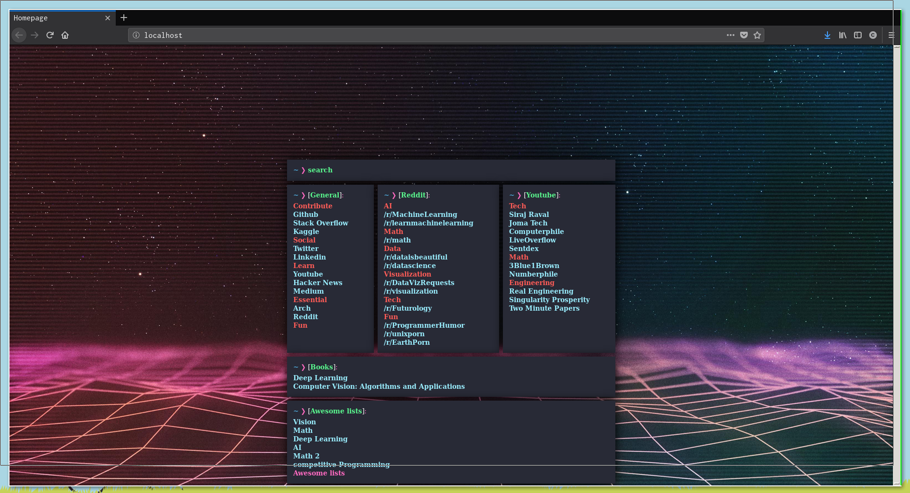

# Essential developer starting page
# Showcase

# Firefox Homepage
1. [Install and run](https://wiki.archlinux.org/index.php/Nginx#Running) nginx on startup
2. Replace the default page with your starting page
3. In your web browser, add a custom url as the homepage `http://localhost/`
# Updating the starting page
It'll be easier to update your starting page if you create a symbolic link to it\
`ln -s /usr/share/nginx/html/Start-Page/index.html index.html`
